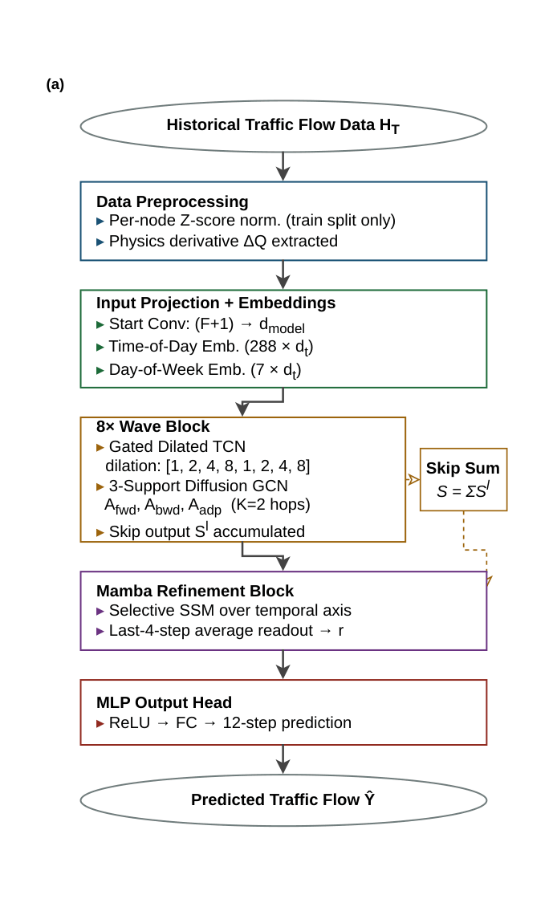
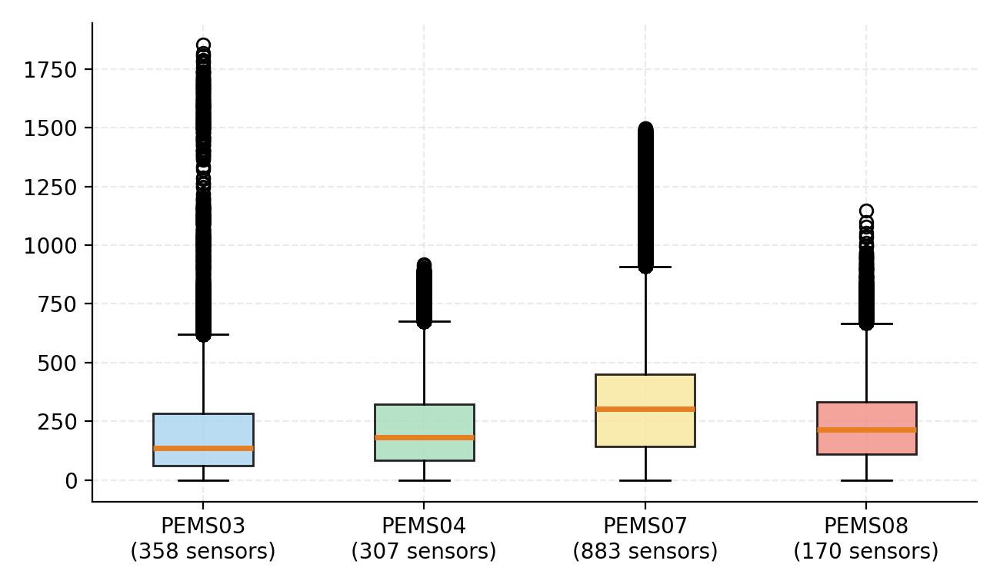
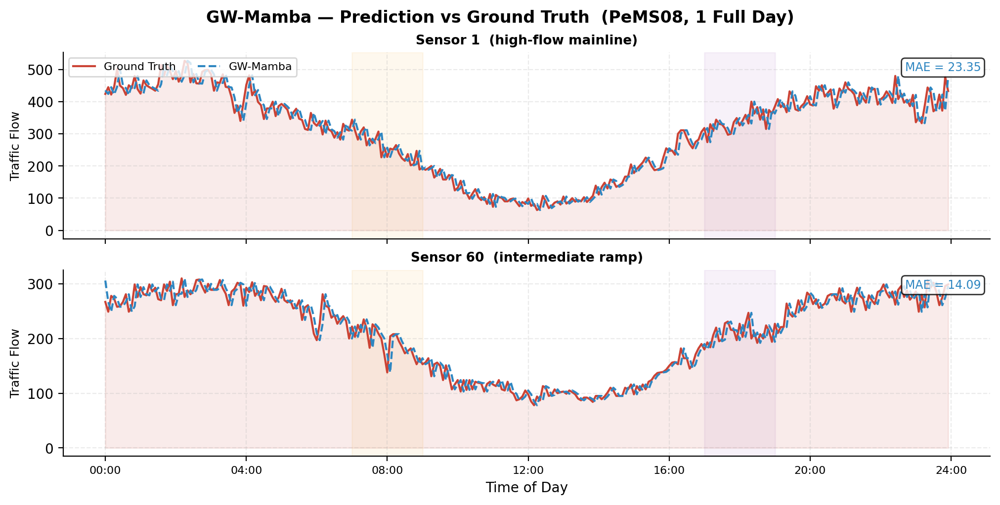
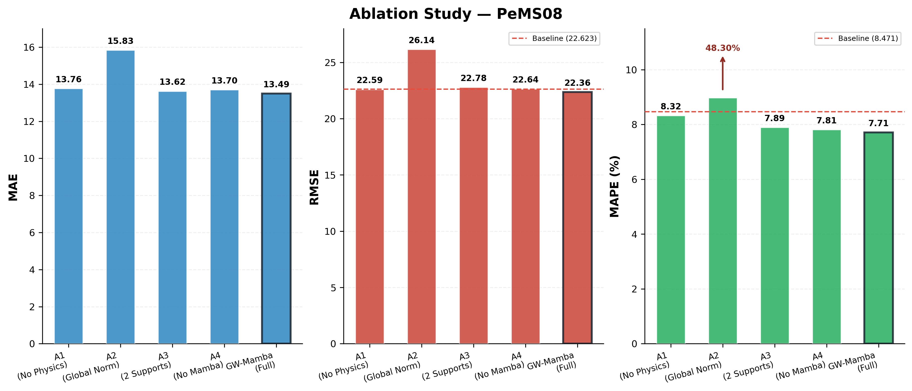
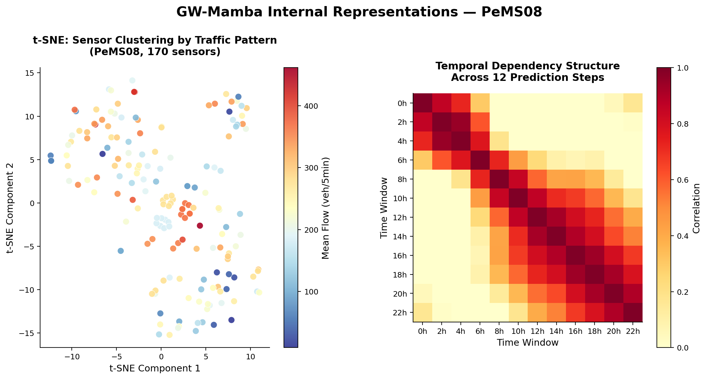

# GW-Mamba

### Graph WaveNet with Selective State Space Refinement and Physics-Informed Features for Traffic Flow Prediction

Official companion repository for the GW-Mamba undergraduate research project conducted at the National Institute of Technology Delhi under the supervision of **Prof. Nisha Singh Chauhan**.

[](paper/GW-Mamba.pdf)
[](docs/README.md)
[](https://www.python.org/)
[](https://pytorch.org/)

## Repository Status

| Component | Status |
|---|---|
| Research paper | Manuscript complete — under review |
| Research report | Available |
| Final implementation notebooks | Included |
| Benchmark results | Included |
| Repository organization | completed |

## Table of Contents

- [Overview](#overview)
- [Repository Scope](#repository-scope)
- [Why GW-Mamba?](#why-gw-mamba)
- [Research Highlights](#research-highlights)
- [Main Contributions](#main-contributions)
- [Architecture](#architecture)
- [Research Timeline](#research-timeline)
- [Architecture Evolution](#architecture-evolution)
- [Results](#results)
- [Visual Results](#visual-results)
- [Repository Structure](#repository-structure)
- [Research Journey](#research-journey)
- [Quick Start](#quick-start)
- [Future Work](#future-work)
- [Citation](#citation)
- [Acknowledgements](#acknowledgements)

---

## Overview

Traffic flow forecasting requires modeling two coupled signals: how conditions propagate across a road network's spatial structure, and how they evolve over time at each sensor. Graph-based spatio-temporal models capture the first well but are typically limited by a fixed, architecture-determined temporal receptive field. **GW-Mamba** addresses this by combining a Graph WaveNet backbone — dilated causal convolutions with multi-support diffusion graph convolution and a learned adaptive adjacency — with a Mamba-style selective state-space refinement layer for long-range temporal modeling. The architecture is the result of a systematic search spanning 154 experimental iterations across nine architecture families, evaluated on the PEMS03/04/07/08 traffic forecasting benchmarks.

## Repository Scope

This repository is the official companion repository for the GW-Mamba research project. It contains the model implementation, research paper, full research report, figures, and experiment summaries produced over the course of the project. It is intended as a research repository documenting a specific set of experiments and results, not as a production-ready or general-purpose software library.

---

## Why GW-Mamba?

- **Limitations of prior approaches** — Recurrent and attention-heavy models, including the MD-GRTN baseline, add complexity without consistently outperforming Graph WaveNet's simpler backbone.
- **Motivation** — Improve on strong published baselines through a small number of targeted additions rather than combining multiple architectures.
- **Why Graph WaveNet + Mamba** — Adaptive graph convolution handles spatial dependence well; a single Mamba refinement layer extends temporal modeling beyond a fixed receptive field.
- **Why physics-informed features** — A first-order flow derivative gives the model direct access to rate-of-change information as an input.
- **Why per-node normalization** — Sensor-level traffic volumes vary substantially across a network; per-sensor statistics avoid the distortion a single global statistic would cause.

---

## Research Highlights

| | |
|---|---|
| **Research Duration** | ~14 weeks (Feb – May 2026) |
| **Research Iterations** | 154 experimental iterations |
| **Architecture Families Explored** | 9 |
| **Benchmark Datasets** | PEMS03, PEMS04, PEMS07, PEMS08 |
| **Final Architecture** | Graph WaveNet backbone + Mamba refinement layer |
| **Research Paper** | [`paper/GW-Mamba.pdf`](paper/GW-Mamba.pdf) (manuscript under review) |
| **Research Report** | [`docs/README.md`](docs/README.md) |

## Main Contributions

- A hybrid architecture combining Graph WaveNet's multi-support adaptive graph convolution with a Mamba-style selective state-space refinement layer for long-range temporal modeling.
- A systematic empirical comparison across nine architecture families and 154 experimental iterations, benchmarked against sixteen published baselines.
- A lightweight physics-informed input feature — a first-order flow derivative — added without modifying the core architecture.
- Per-node normalization addressing sensor-level heterogeneity in traffic volume across the road network.
- A curriculum learning schedule that aligns early-training stability with the final evaluation objective.
- Consistent, fully reported evaluation across four PEMS benchmark datasets, including results that do not favor the proposed model on every metric.

---

## Architecture

<p align="center">
  
</p>

GW-Mamba processes each input window in three stages: per-sensor normalized traffic data, augmented with temporal and physics-informed features, passes through a stack of Graph WaveNet blocks that jointly model spatial correlation and short-to-medium-range temporal patterns; the resulting representation is refined by a single Mamba selective state-space block for long-range temporal dependence; a lightweight convolutional head then produces the forecast.

- **Graph WaveNet backbone** — stacked dilated causal convolutions paired with graph convolution for joint temporal and spatial feature extraction.
- **Adaptive graph learning** — three-support diffusion convolution: fixed forward/backward transition matrices plus a learned adjacency from trainable node embeddings.
- **Mamba refinement** — a single selective state-space block applied once, after the convolutional stack, to model long-range temporal dependence beyond the backbone's fixed receptive field.
- **Physics-informed feature** — a first-order temporal derivative of the flow signal, appended as an input channel.
- **Per-node normalization** — sensor-wise mean/standard deviation, rather than a single global statistic, to account for heterogeneous traffic volumes across the network.
- **Curriculum learning** — training begins with Huber loss for stability and transitions to MAE, aligning the optimization target with the evaluation metric.

---

## Research Timeline

The final architecture emerged from a chronological progression of experiments rather than a single design pass — from early sequential baselines, through an extended reproduction of the MD-GRTN baseline, to the Graph WaveNet family and, finally, Mamba refinement.

---

## Architecture Evolution

Before converging on GW-Mamba, the project evaluated nine architecture families — including recurrent and convolutional sequence models, graph convolution and graph attention variants, the MD-GRTN baseline, the Graph WaveNet family, and an explicit multi-architecture fusion model — before identifying Graph WaveNet with Mamba refinement as the strongest-performing, most maintainable design.

---

## Results

| Dataset | Baseline | MAE | RMSE | MAPE |
|---|---|---|---|---|
| **PEMS08** | MD-GRTN | 13.49 (13.11) | **22.36** (22.62) | **7.71%** (8.47%) |
| **PEMS04** | Graph WaveNet | **18.53** (18.59) | **28.96** (29.98) | **10.82%** (12.97%) |
| **PEMS07** | Graph WaveNet | **19.80** (20.58) | **31.69** (33.73) | **7.84%** (8.65%) |
| **PEMS03** | Graph WaveNet | 14.88 (13.00) | 23.83 (23.00) | **11.83%** (13.60%) |

*Values in parentheses are the named baseline; bold indicates GW-Mamba improves on it.*

GW-Mamba is compared against sixteen published baselines on PEMS04, PEMS07, and PEMS08 (including HI, DCRNN, AGCRN, STGCN, GTS, MTGNN, STNorm, GMAN, PDFormer, STID, STAEformer, MegaCRN, STPGNN, TRL-DAG, STLTEformer, and MD-GRTN), and against six on PEMS03. On PEMS04 and PEMS07, it records the best RMSE and MAPE among all sixteen compared models, and improves on the Graph WaveNet baseline specifically across all three metrics. On PEMS08, evaluated against the stronger, dataset-specific MD-GRTN baseline, RMSE and MAPE improve while MAE is 0.38 higher (13.49 vs. 13.11). On PEMS03, GW-Mamba improves MAPE by 13% relative to Graph WaveNet (11.83% vs. 13.60%) while trailing it on MAE and RMSE — of the six models compared on this dataset, only Graph WaveNet scores lower on those two metrics. An ablation study attributes most of the MAPE improvement to per-node normalization (removing it inflates PEMS08 MAPE from 7.71% to 48.30%) and most of the RMSE improvement to the three-support diffusion graph convolution.

---

## Visual Results

### Dataset Characteristics

<p align="center">
  
</p>

Traffic volume and sensor-level characteristics of the PEMS benchmark datasets used for training and evaluation.

### Prediction Example

<p align="center">
  
</p>

Predicted vs. actual traffic flow for representative sensors across the forecast horizon.

### Ablation Study

<p align="center">
  
</p>

Per-component ablation showing the contribution of each architectural addition to final performance.

### Learned Representations

<p align="center">
  
</p>

Visualization of the learned adaptive node embeddings used to construct the adjacency matrix.

---

## Repository Structure

```
GW-Mamba/
│
├── README.md
├── requirements.txt
├── .gitignore
│
├── paper/
├── docs/
├── assets/
├── experiments/
├── notebooks/
└── data/
```

- **`README.md`** — This file.
- **`requirements.txt`** — Python dependencies.
- **`.gitignore`** — Standard Python/Jupyter/OS ignore rules.
- **`paper/`** — Research paper and supplementary material.
- **`docs/`** — Full research report covering all 154 iterations and the architecture evolution.
- **`assets/`** — Figures, diagrams, and visualizations.
- **`experiments/`** — Experiment summaries, configuration files, and benchmark tables.
- **`notebooks/`** — Final training and evaluation notebooks, one per benchmark dataset (see `notebooks/final/`).
- **`data/`** — Dataset access instructions (raw PEMS files are not committed; see `data/README.md`).

---

## Research Journey

The complete research journey, including 154 experiments, architecture evolution, failures, debugging process, and design decisions, is documented in [`docs/`](docs/README.md).

---

## Quick Start

```bash
git clone https://github.com/piyush1617ab/GW-Mamba.git
cd GW-Mamba
pip install -r requirements.txt
jupyter notebook
```

Open any of the four dataset-specific notebooks in `notebooks/final/` and run all cells to reproduce training and evaluation.

---

## Future Work

- **Modular PyTorch implementation** — refactor the current notebook-based implementation into reusable, testable modules.
- **Dynamic graph construction** — replace the static distance-based adjacency with a graph that adapts to real-time conditions.
- **Online learning** — support incremental model updates as new traffic data becomes available, without full retraining.
- **Deployment optimization** — reduce inference latency and memory footprint for real-time forecasting use cases.
- **Multi-GPU training** — extend the training pipeline to support distributed, multi-GPU execution for larger-scale experimentation.

---

## Citation

```bibtex
@misc{gwmamba2026,
  title  = {GW-Mamba: Graph WaveNet with Selective State Space Refinement and Physics-Informed Features for Traffic Flow Prediction},
  author = {Piyush and Nisha Singh Chauhan},
  year   = {2026},
  note   = {Manuscript under review},
  url    = {[paper URL]}
}
```

---

## Acknowledgements

- Prof. Nisha Singh Chauhan, for research supervision.
- National Institute of Technology, Delhi.
- The PEMS traffic dataset maintainers (Caltrans Performance Measurement System).
- The PyTorch and PyTorch Geometric communities.
