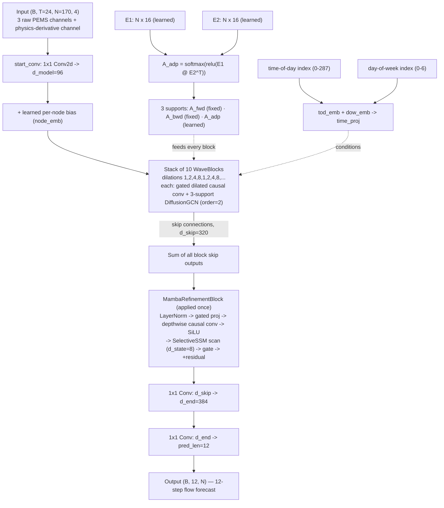

# 05 — Final Architecture: GWMamba

This chapter describes the architecture exactly as it appears in `gw mamba/gw-mamba-pem07.ipynb` (May 25 — the last-dated notebook in the corpus), cross-checked against `gw-mamba-pems08_baseline.ipynb` (May 13), whose own code comment states the architecture is *"IDENTICAL to PEMS08 baseline"* across all four dataset-specific notebooks. Everything below is transcribed or paraphrased from real class definitions, not reconstructed from the paper (which wasn't part of the source material — see the note at the top of the README).

## Data flow



## Component walkthrough

### 1. Input and features
Four channels per sensor per timestep: the standard PEMS channels (flow being the target; the raw `.npz` files carry additional channels typically used for occupancy/speed in this dataset family) plus the physics-derivative channel (`diff[t] = flow[t] − flow[t−1]`, see [`03_key_innovations.md`](03_key_innovations.md)). Input covers `seq_len=24` steps (2 hours at 5-minute resolution — `tod_emb` has 288 slots, confirming 5-minute granularity: 24×60/5=288); output covers `pred_len=12` steps (1 hour ahead).

### 2. Three-support diffusion graph convolution
```python
def get_supports(self):
    A_adp = F.softmax(F.relu(self.E1 @ self.E2.T), dim=-1)
    return [self.A_fwd, self.A_bwd, A_adp]
```
`A_fwd`/`A_bwd` are fixed forward/backward random-walk transition matrices built from the sensor distance graph; `A_adp` is fully learned from two trainable node-embedding matrices (`E1`, `E2`, each `170 × 16`). `DiffusionGCN` runs order-2 diffusion (two-hop propagation) independently across all three supports and concatenates the results — the model sees both the physical road topology (two directions) and a learned, data-driven notion of "which sensors behave alike."

### 3. WaveBlock stack (the Graph WaveNet backbone)
Ten blocks, dilations cycling `[1, 2, 4, 8, 1, 2, 4, 8, ...]` — two full dilation cycles rather than one long monotonic one, a design that revisits short-range patterns twice instead of only ever widening. Each block: a gated dilated causal convolution (temporal) feeding a 3-support `DiffusionGCN` (spatial), with a skip connection accumulated into a shared `d_skip=320`-wide buffer that every block contributes to — the same skip-accumulation pattern from the original Graph WaveNet paper, unchanged from the Phase 3 experiments (see [`01_research_timeline.md`](01_research_timeline.md)).

### 4. Mamba refinement (the one addition on top of Graph WaveNet)
Applied **once**, after the WaveBlock stack, to the accumulated skip representation — not per-layer, not on the raw input:
```python
class MambaRefinementBlock(nn.Module):
    def forward(self, x):                      # x: (B, D, N, S)
        h = self.norm(x.permute(0,2,3,1).reshape(B*N, S, D))
        xz = self.in_proj(h)
        z, g = xz.chunk(2, dim=-1)
        z = F.silu(self.conv1d(z.permute(0,2,1))[..., :S].permute(0,2,1))
        z = self.ssm(z)
        out = self.drop(self.out_proj(z * F.silu(g)))
        return out.reshape(B,N,S,D).permute(0,3,1,2) + x   # residual
```
The reshape (`B*N, S, D`) treats every node's skip-accumulated sequence as an independent 1D sequence for the SSM scan — spatial structure has already been handled by the WaveBlock/DiffusionGCN stack; this layer's job is purely a long-range temporal pass over what's left. `SelectiveSSM` itself is a compact selective-scan implementation: an input-dependent step size (`Δt`, via a softplus-gated linear layer), per-channel log-parameterized state-transition values, and a sequential recurrence over the 24-step sequence — small (`d_state=8`) relative to language-model-scale Mamba, sized for this problem rather than borrowed wholesale.

### 5. Output head
Two 1×1 convolutions (`d_skip=320 → d_end=384 → pred_len=12`) map the refined skip representation directly to a 12-step forecast per sensor.

## Configuration (from the frozen final notebooks)

| Parameter | Value | Parameter | Value |
|---|---|---|---|
| `num_nodes` | 170 | `d_model` | 96 |
| `in_features` | 3 (+1 physics) | `d_skip` | 320 |
| `seq_len` | 24 | `d_end` | 384 |
| `pred_len` | 12 | `d_time` | 48 |
| `n_layers` | 10 | `n_supports` | 3 |
| `gcn_order` | 2 | `adp_emb` | 16 |
| `mamba d_state` | 8 | `dropout` | 0.10 |

## What this architecture is — and isn't

Worth stating plainly, since "GW-Mamba" invites assumptions: this is **Graph WaveNet's proven spatial-temporal backbone, unmodified in its core mechanics, plus one Mamba-style selective-SSM refinement layer applied once at the end** — not a from-scratch redesign, and not Mamba blocks replacing the dilated convolutions throughout. That's a deliberate, and reasonable, scope: Phase 3 already established Graph WaveNet as the strongest simple backbone (see [`01_research_timeline.md`](01_research_timeline.md)); Phase 4's more ambitious combination attempt (FUSION, three architectures merged) didn't produce a documented result (see [`04_failed_experiments_and_debugging.md`](04_failed_experiments_and_debugging.md)); the architecture that did work is the narrower one — keep the strongest backbone, add a single well-targeted mechanism addressing a specific gap (long-range temporal modeling beyond dilated convolution's reach), verify it holds up across four datasets, then stop.
